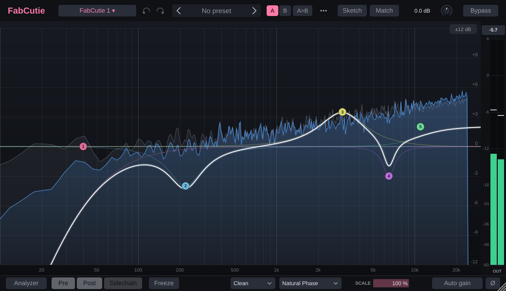

# FabCutie

[](https://github.com/danmcgrath10/fabcutie/actions/workflows/build.yml)
[](https://github.com/danmcgrath10/fabcutie/releases/latest)
[](LICENSE)

A free, open-source parametric EQ for macOS and Windows, in AU, VST3, CLAP and standalone formats. Draw on the graph, add dynamic and spectral bands, match a reference, and pick zero-latency, natural or linear phase.



FabCutie is an original project inspired by the workflow of modern "draw-on-the-graph" EQs such as FabFilter Pro-Q. It contains no FabFilter code, artwork or assets and is not affiliated with FabFilter.

## Contents

- [Download and install](#download-and-install)
- [Features](#features)
- [Using FabCutie](#using-fabcutie)
  - [The graph](#the-graph)
  - [Dynamic and spectral bands](#dynamic-and-spectral-bands)
  - [EQ Sketch and EQ Match](#eq-sketch-and-eq-match)
  - [Assist: resonances and unmasking](#assist-resonances-and-unmasking)
  - [Analyzer](#analyzer)
  - [Phase modes](#phase-modes)
  - [Workflow](#workflow)
  - [Instance list](#instance-list)
  - [Surround](#surround)
- [Troubleshooting](#troubleshooting)
- [Build from source](#build-from-source)
- [License](#license)

## Download and install

Get the installer from the [latest release](https://github.com/danmcgrath10/fabcutie/releases/latest). No GitHub account is needed.

### macOS (11 Big Sur or later, Apple Silicon and Intel)

1. Download `FabCutie-<version>-macOS.pkg` and double-click it.
2. Pick the formats you want: Audio Unit (Logic Pro, GarageBand), VST3, CLAP and the standalone app.
3. By default everything installs for all users (`/Library/Audio/Plug-Ins`, `/Applications`). To install for yourself only, with no administrator password, click **Change Install Location...** on the Installation Type step and choose **Install for me only**.
4. Quit and reopen your DAW. In Logic Pro, FabCutie is under **Audio FX → FabCutie → FabCutie**.

The installer isn't signed with an Apple Developer ID, so the first time macOS says it can't check it for malware. Click **Done**, open **System Settings → Privacy & Security**, scroll down to the message about FabCutie and click **Open Anyway**. You only need to do this once per download.

### Windows

1. Download `FabCutie-<version>-Windows-Setup.exe` and run it.
2. Choose where the standalone app goes (`C:\Program Files\FabCutie` by default) and, after picking formats, the VST3 and CLAP folders (`C:\Program Files\Common Files\VST3` and `...\CLAP` by default, which every host scans). Updates remember your choices.

If SmartScreen warns about an unknown publisher, click **More info → Run anyway**. Uninstall from **Settings → Apps**. Silent installs take `/DIR=`, `/VST3DIR=` and `/CLAPDIR=`.

## Features

**Filters**
- Up to 24 bands: Bell, Low/High Shelf, Low/High Cut, Notch, Band Pass, Tilt Shelf, Flat Tilt and All Pass.
- Cut slopes from 6 to 96 dB/oct plus brickwall. For cuts, Q 1 is a flat (Butterworth) knee and higher Q adds resonance.
- Frequency 10 Hz to 30 kHz, gain ±30 dB, Q 0.025 to 40.
- Per-band placement: Stereo, Left, Right, Mid or Side.
- Every control is automatable and glides smoothly; type, slope, placement and bypass changes fade instead of clicking.

**Dynamics and smart tools**
- Dynamic EQ with internal or external sidechain on bell, shelf and tilt bands.
- Spectral dynamics that work bin by bin inside a band, to tame one resonance rather than the whole region.
- EQ Sketch: draw a curve and get the bands that make it.
- EQ Match: move your track's tonal balance towards a reference.
- Resonance finder: listens to your track and adds narrow dynamic cuts on the peaks that ring out.
- Auto-unmasking: pick another FabCutie as the key (say, the kick on the bass) and it finds where the two collide and ducks this track there only while the key plays. No sidechain routing needed.

**Sound**
- Zero Latency, Natural Phase and Linear Phase modes.
- Character modes (Clean, Gentle, Warm), 4x oversampled.

**Display**
- Real-time pre, post and sidechain spectrum analyzer with freeze, collision detection and spectrum grab.
- Intelligent band solo, piano roll, output meter with peak hold.

**Workflow**
- Undo/redo, A/B compare, factory and user presets, copy and paste of bands (also between instances), typed values, auto gain, gain scale, polarity invert, resizable window and MIDI learn.
- Instance list to see, overlay and edit every FabCutie in the session.
- Mono, stereo and surround up to 9.1.6, including Dolby Atmos 7.1.4 beds.

## Using FabCutie

### The graph

| Action | What it does |
|---|---|
| Double-click empty space | Add a band there (a cut below 20 Hz or above 20 kHz, otherwise a bell) |
| Drag a node | Frequency and gain; for cut, notch and band pass, up/down sets Q. Hold Shift for fine moves |
| Scroll over a node | Q. With Alt/Option held, steps a cut's slope |
| Double-click a node | Remove the band |
| Cmd/Ctrl/Shift-click, or drag on empty space | Select several nodes, then drag them together |
| Right-click a node | Filter type, slope, placement, enter values, copy, paste settings, remove |
| Right-click empty space | Add a band, display range, paste bands, remove all |
| Delete / Backspace | Remove the selected bands |
| Return | Type the selected band's frequency, gain and Q |
| Alt/Option-click and hold a node | Solo the band while the mouse is down |
| Hover a spectrum peak, then click and drag | Spectrum grab: adds a bell on the peak and drags it |
| Cmd/Ctrl-C, Cmd/Ctrl-V | Copy the selected bands, paste them as new bands |
| Cmd/Ctrl-Z, Cmd/Ctrl-Shift-Z | Undo, redo |
| `±12 dB` button (top right) | Cycle the display range: ±3, ±6, ±12, ±30 dB |

The selected band's panel floats over the graph with its type, slope, placement, frequency/gain/Q knobs (double-click a knob to reset it) and a Solo button, plus the dynamics controls on a second row. Frequencies can be typed in Hz, with `k` for kHz (`2.5k`) or as a note name (`A4`, `C#2`). Bands on Left, Right, Mid or Side get their own dashed curve labelled L, R, M or S.

### Dynamic and spectral bands

Switch on **DYN** in the band panel and the band's gain follows the signal level. Above the threshold each dB over moves the gain a dB towards the range (a negative range ducks, a positive one lifts), with a 6 dB soft knee and adjustable attack and release. The live gain change shows in the panel header.

Each dynamic band listens to its own input (**Internal**) or the plugin's sidechain input (**External**), either filtered to the band's region or wide open. In Logic Pro, choose a track or bus from the **Side Chain** menu in the plugin window's header. With no sidechain selected, external bands hear silence and stay at their static gain.

Switch on **SPEC** as well and the band works bin by bin, so only the frequencies inside it that cross the threshold move. The threshold reads like the analyzer (a full-scale sine is 0 dB). While any band is spectral the plugin adds 2048 samples of latency.

### EQ Sketch and EQ Match

- **Sketch:** press **Sketch** in the header and draw the curve you want. On release it becomes up to 8 bells and shelves in the free band slots. Esc leaves sketch mode.
- **Match:** press **Match** and pick a reference, either the **Sidechain** input or a **Captured** one (play the reference and press **Capture**). Play your track with **Learn** on, then **Apply** to add up to 12 bands that move its tonal balance towards the reference. Level differences are ignored, **Amount** scales the result, and the captured reference is saved with the session.

### Assist: resonances and unmasking

Press **Assist** in the header. Both tools listen while **Learn** is on, show what they found, and add dynamic bell bands in the free slots when you press **Apply**. The bands are ordinary dynamic bands, so you can tweak or remove any of them afterwards.

- **Resonances:** play the track with **Learn** on. Assist marks the narrow peaks that stand out of the spectrum around them (from 150 Hz up, since lower peaks are mostly the notes being played) and **Apply** adds a narrow dynamic cut on each, starting at the peak's usual level, cutting up to as far as the peak stands out (12 dB at most). **Sensitivity** sets how far a peak must stand out.
- **Unmask:** pick the **Key**, the track that should cut through this one. It can be any other FabCutie in the session (its output is sent across inside the host, so there's nothing to route) or the host's sidechain. Play both with **Learn** on: Assist finds where the two are both strong and **Apply** adds broad dynamic bands there that listen to the key and duck this track by **Depth** while the key plays. The key also feeds the analyzer's Sidechain trace and its collision display.

A key instance takes the place of the host's sidechain for every External band in this instance, and is saved with the session. Instances follow each other within about a block of audio, which suits a detector with attack and release times; the key only reaches instances in the same host process, and offline bounces depend on the host rendering both tracks together.

### Analyzer

The strip under the graph switches the **Pre** (input), **Post** (output) and **Sidechain** spectra on and off, and **Freeze** holds the display. The **Analyzer** menu sets:

- **Range:** 60, 90 or 120 dB from top to bottom.
- **Speed:** how quickly the spectrum falls back.
- **Tilt:** 0 to 6 dB/oct around 1 kHz. At 4.5 dB/oct pink noise, and most mixes, look level.
- **Resolution:** 2048 to 16384-point FFT. Higher shows more low-end detail but reacts more slowly.
- **Show collisions with sidechain:** red shading where the output and the sidechain crowd the same frequencies.
- **Spectrum grab** on or off.

### Phase modes

Pick the mode from the menu in the bar under the graph:

| Mode | Latency | What it's for |
|---|---|---|
| **Zero Latency** (default) | none | Minimum-phase filters that stay stable under fast automation. Curves near Nyquist narrow slightly ("cramping"), as in any EQ of this kind. |
| **Natural Phase** | about 7 ms | Matches analog filters' magnitude and phase all the way to Nyquist, with no cramping. |
| **Linear Phase** | 27 ms (Low) to 347 ms (Maximum) at 48 kHz | No phase shift, so transients and low-end timing stay intact, at the cost of pre-ringing on steep cuts and narrow low bells. Resolution (Low to Maximum, 2048 to 32768 taps) is in the same menu. |

FabCutie reports its latency to the host, so your DAW keeps it in time. Changing mode fades the output out and back in, and the mode isn't automatable because it changes the latency. Dynamic bands (other than spectral ones) always run as zero-latency filters after the FIR stage.

### Workflow

The header holds **undo** and **redo**, the **preset browser**, **A / B** and **A>B**, and a **•••** menu.

- **Undo / redo** covers every edit made in the window: a whole drag is one step, as is an A/B switch or a preset load. Host automation and bypass aren't recorded.
- **A/B:** two complete settings, both saved with the session. **A>B** copies the current slot to the other.
- **Presets:** user presets are files in `~/Library/Audio/Presets/FabCutie` on macOS and `FabCutie/Presets` in the app data folder on Windows, so they work across sessions and machines.
- **Gain scale** (bottom right): scales every bell, shelf and tilt gain, and each dynamic range, from -100 % (inverted) through 0 % (flat) to 200 %.
- **Auto gain:** offsets the output by the curve's average level change, calculated rather than measured so it never pumps. Cuts, notches and band passes aren't compensated.
- **Ø:** flips the output polarity.
- **Window size:** drag the corner, or pick a size from the **•••** menu. Size and display range are saved per instance.
- **MIDI learn:** right-click any control, choose **MIDI Learn** and move a controller. Logic Pro doesn't send MIDI to Audio Unit effects, so use Logic's own controller assignments there; MIDI learn works in the VST3 and standalone versions.

### Instance list

The button next to the logo names the instance on screen (the track name, or "FabCutie 1", "FabCutie 2"...). Click it to list every FabCutie in the session:

- **Show** draws that instance's curve behind this one, in its own colour, to help carve space between tracks.
- **Edit** points this window at that instance, with a coloured frame saying which one you're editing. **Back** returns to this window's own instance.
- Double-click a name to rename the instance. Clear it to go back to the track name.

Instances find each other when the host loads them into the same process, as Logic Pro and most DAWs do.

### Surround

FabCutie runs on every layout up to 9.1.6 (16 channels), same layout in and out. In surround, band placement picks speakers by position:

| Placement | Stereo | Surround |
|---|---|---|
| Stereo / All | both channels | every speaker |
| Left | left | speakers on the left (L, Ls, Lrs, Ltf...) |
| Right | right | speakers on the right |
| Mid / Centre | mid signal | the centre line: C, LFE, Cs and top/bottom centres |
| Side / Sides | side signal | every speaker off the centre line |

The sidechain input stays mono or stereo. Linear phase and spectral processing are stereo only, so surround always runs at Zero Latency and spectral bands act as ordinary dynamic bands.

## Troubleshooting

- **FabCutie doesn't show up in Logic Pro:** open **Logic Pro → Settings → Plug-in Manager**, select FabCutie and click **Reset & Rescan Selection**.
- **macOS blocks the installer:** see the Open Anyway steps under [macOS](#macos-11-big-sur-or-later-apple-silicon-and-intel).
- **Two copies of FabCutie:** the installer removes copies in your own Plug-Ins folder. If you also copied a build there by hand, delete one of them.

## Build from source

You need CMake 3.22 or newer and a C++20 compiler: Xcode or its Command Line Tools on macOS (`brew install cmake`), Visual Studio on Windows.

```sh
git clone https://github.com/danmcgrath10/fabcutie.git
cd fabcutie
cmake -S . -B build -DCMAKE_BUILD_TYPE=Release
cmake --build build --config Release -j
ctest --test-dir build -C Release --output-on-failure
```

JUCE and [clap-juce-extensions](https://github.com/free-audio/clap-juce-extensions) are downloaded on the first configure. Useful options:

| Option | Effect |
|---|---|
| `-DFABCUTIE_BUILD_CLAP=OFF` | Skip the CLAP build |
| `-DFABCUTIE_JUCE_PATH=/path/to/JUCE` | Use a JUCE checkout you already have |
| `-DFABCUTIE_COPY_AFTER_BUILD=ON` | Install the plugins into your user Plug-Ins folders after every build |
| `-G Xcode` | Generate an Xcode project instead |

macOS builds are universal. Outputs land in `build/FabCutie_artefacts/Release/` under `AU/`, `VST3/`, `CLAP/` and `Standalone/`.

To try a source build in Logic Pro, copy `FabCutie.component` into `~/Library/Audio/Plug-Ins/Components/` (delete any installer copy in `/Library/Audio/Plug-Ins/Components` first), then validate it:

```sh
killall -9 AudioComponentRegistrar 2>/dev/null || true
auval -v aufx Fceq Fbct   # should end with AU VALIDATION SUCCEEDED
```

### Project layout

```
CMakeLists.txt          JUCE fetch and plugin target
Source/
  PluginProcessor.*     audio processor, state save/restore
  PluginEditor.*        editor window
  Parameters.*          every automatable parameter, with stable IDs
  InstanceRegistry.h    every FabCutie in the host process, for the instance list
  dsp/                  audio-thread code: EQ engine, filter design, phase modes, dynamics
  ui/                   editor components: graph, band panel, analyzer, meter
Tests/                  offline DSP tests (ctest)
packaging/              macOS .pkg and Windows Inno Setup installers
.github/workflows/      macOS and Windows CI: tests, installers, auval, releases
```

### CI and releases

Every push to `main` builds and tests on macOS and Windows, test-installs both installers and runs `auval`. The run's Artifacts section has the installers and plain zips of each format. To publish a release, set the version in `CMakeLists.txt`, then push a matching tag (`git tag v0.5.1 && git push origin v0.5.1`) or run **Actions → Build → Run workflow** on `main` with **publish** ticked.

## License

MIT, see [LICENSE](LICENSE). JUCE is used under its own license ([AGPLv3 or commercial](https://juce.com/legal/juce-8-licence/)); distributing binaries of an open-source plugin under JUCE's AGPL terms is fine as long as the source stays available.
